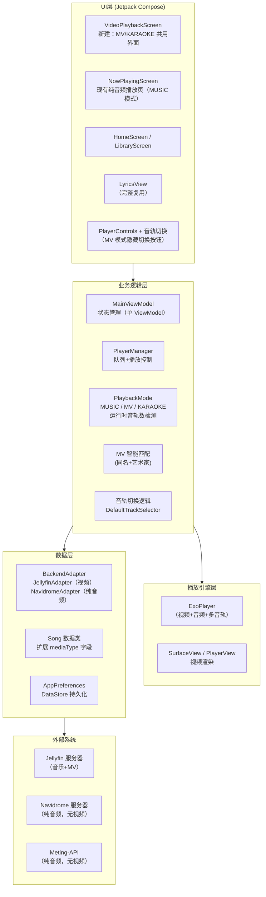
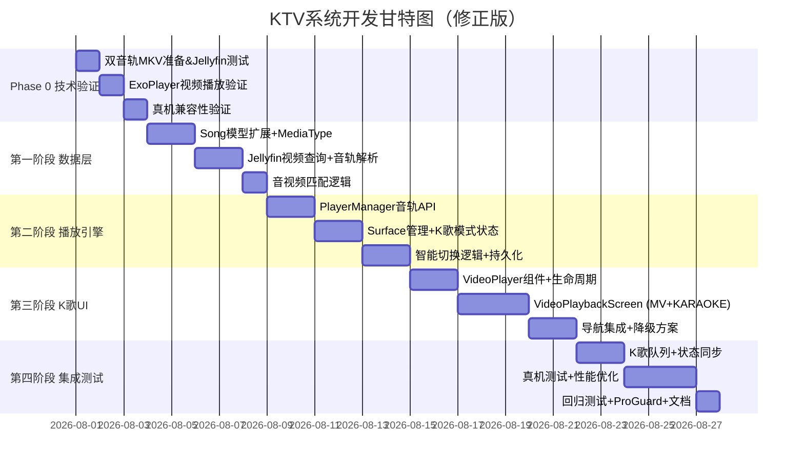

# NASMusicTV → 家庭KTV系统 完整开发方案

> **修正版**：基于实际代码库（commit `fd2ae8e`, v2.7.0, 2026-07-20）的结构进行编写


## 一、项目概述

### 1.1 项目背景与目标

基于 **NASMusicTV**（GitHub: hxzhang2000/NASMusicTV）进行二次开发，将其从 Android TV 音乐播放器改造为完整的**家庭客厅KTV系统**。

**核心目标**：
- 保留 NASMusicTV 全部现有功能（Jellyfin/Navidrome 连接、歌词系统、网络音乐、均衡器、首页仪表盘等）
- 扩展**视频 MV 播放**能力（支持 MKV/MP4 视频文件）
- 实现**三种播放模式**：
  - 🎵 **音乐模式**（MUSIC）— 纯音频文件（MP3/FLAC），现有行为
  - 🎬 **MV 模式**（MV）— 视频文件但仅有 1 条音轨，纯观看音乐视频
  - 🎤 **K 歌模式**（KARAOKE）— 视频文件含 ≥2 条音轨，可切换原唱/伴奏
- 模式在**运行时由视频文件的轨道数量自动决定**，不依赖服务端元数据

### 1.2 技术栈（实际代码库状态）

| 层级 | 技术选型 | 说明 |
|------|----------|------|
| 语言 | Kotlin 2.2.10 | 100% Kotlin |
| UI 框架 | Jetpack Compose for TV (`androidx.tv:tv-material` alpha) | 声明式 UI，`ExperimentalTvMaterial3Api` |
| 播放引擎 | Media3 ExoPlayer (MediaLibraryService) | 已集成，原生支持视频渲染与多音轨 |
| 网络层 | OkHttp | 所有后端/网络请求均用 raw OkHttp，无 Retrofit |
| 状态管理 | 手动 DI + 单 `MainViewModel` | 无 DI 框架，无 Navigation Component |
| 数据持久化 | DataStore | AppPreferences 封装所有偏好/缓存/播放记录 |
| 图片加载 | Coil | 支持 302 重定向封面 |
| 拼音搜索 | TinyPinyin | 兼容 API 22+ |
| 构建 | Gradle 9.5.0 (wrapper 本地文件) | JDK 来自 Android Studio JBR 21 |
| 最低 SDK | API 22 (Android 5.1) | 影响硬件解码可用性 |
| 协议 | GPL v3 | 二次开发需保持开源 |

### 1.3 现有功能清单与复用评估

| 功能模块 | 实际组件 | K 歌复用价值 |
|----------|---------|-------------|
| **歌词系统** | `LyricsView.kt`（逐行/逐字高亮 50ms 刷新）+ `LyricsManager.kt`（多来源获取）+ `LrcParser.kt` | ✅ 直接复用 |
| **播放队列** | `PlayerManager.kt`（队列 curd + 持久化 + 进度轮询）+ `MainViewModel` 内部队列状态 | ✅ 需扩展支持视频项 |
| **Jellyfin 后端** | `JellyfinAdapter.kt`（raw OkHttp，支持 `MediaStreams`） | ✅ 可扩展视频查询 |
| **Navidrome 后端** | `NavidromeAdapter.kt`（Subsonic API） | ⚠️ **仅支持 MUSIC 模式（纯音频）**，无 MV 或 KARAOKE |
| **遥控器适配** | 完整 D-Pad 导航 + HdmiCec + MediaKeyHandler + FocusableSurface | ✅ 直接复用 |
| **均衡器** | `EqualizerScreen.kt` + `PlayerManager.setEqualizerBands()` | ✅ 直接复用 |
| **网络音乐** | `MetingApiService.kt` + `NetworkMusicManager.kt`（纯音频搜索/收藏） | ❌ 无法获得 MV |
| **封面系统** | `CoverCarousel.kt` + `AsyncImage`（候选列表 + 轮播 + fallback） | ✅ 直接复用 |
| **手动导航** | `AppRoot.kt` 中 `when(currentScreen)` 切换 | ✅ 只需新增 `Screen.VIDEO_PLAYER` |
| **首页仪表盘** | `HomeScreen.kt` + `HomeDashboardData`（当前播放/天气/统计预览） | ⚠️ 需增加 MV 入口 |

### 1.4 实际代码库目录结构

```
app/src/main/java/com/nasmusic/tv/
├── NasMusicApp.kt              # DI 容器（构造全局实例）
├── backend/
│   ├── BackendAdapter.kt       # 接口
│   ├── BackendRegistry.kt
│   ├── impl/
│   │   ├── JellyfinAdapter.kt  # 支持 Jellyfin REST API
│   │   └── NavidromeAdapter.kt # Subsonic API（纯音频）
│   ├── network/                # Meting-API 网络音乐（独立于 NAS）
│   └── weather/                # 天气电台
├── data/
│   ├── model/                  # Song, Album, Artist, Playlist, UiState, Screen, 等
│   └── prefs/                  # AppPreferences（DataStore）
├── lyrics/                     # LyricsManager, LrcParser, LyricsNetworkProvider
├── player/
│   ├── PlayerManager.kt        # 单例，持有 ExoPlayer 引用
│   └── PlaybackService.kt      # Media3 MediaLibraryService
├── ui/
│   ├── MainActivity.kt         # 单 Activity
│   ├── components/
│   │   ├── AppRoot.kt          # 顶层 Composable（手动路由）
│   │   ├── LyricsView.kt       # 歌词渲染
│   │   ├── PlayerControls.kt   # 播放控制按钮
│   │   ├── FocusableSurface.kt # 可聚焦基础组件
│   │   ├── SongInfoPanel.kt    # 歌曲详情面板
│   │   └── VisualEqualizer.kt  # 频谱动画
│   ├── screens/
│   │   ├── NowPlayingScreen.kt # 当前播放页
│   │   ├── LibraryScreen.kt    # 曲库浏览（7 Tab）
│   │   ├── HomeScreen.kt       # 首页仪表盘
│   │   ├── SettingsScreen.kt   # 设置
│   │   ├── EqualizerScreen.kt  # 均衡器
│   │   └── network/            # 网络音乐 + 天气电台子 Tab
│   ├── theme/                  # Theme, Color
│   └── viewmodel/
│       └── MainViewModel.kt    # 单一 ViewModel（~2000 行）
└── util/                       # AppLog, EncodingUtils, PinyinUtils, 等
```


## 二、技术架构设计（修正版）

### 2.1 总体架构



**关键架构约束**：
- 单 ViewModel 架构意味着所有播放状态（包括 K 歌模式）集中在 `MainViewModel.kt` 中，不新建第二个 ViewModel
- `PlayerManager` 单例持有 ExoPlayer 实例，不需要修改它的生命周期管理方式
- `PlaybackService` (Media3 `MediaLibraryService`) 已支持 ExoPlayer 视频渲染，只需确保 Surface 创建/销毁时机

### 2.2 数据模型扩展方案

**不新建 `MediaItem` 类**，直接在现有 `Song` 上扩展（已有 30+ 处引用，新增类会导致接口全改）：

```kotlin
// data/model/Song.kt — 在现有 Song 上增加字段
data class Song(
    val id: String,
    val name: String,
    val artists: List<String>,
    val album: String,
    val albumId: String?,
    val artistId: String?,
    val duration: Long,
    val track: Int?,
    val coverUrl: String?,
    val playCount: Int,

    // === 新增视频相关字段 ===
    // 只区分 AUDIO / VIDEO，K 歌还是 MV 由运行时轨道数决定
    val mediaType: MediaType = MediaType.AUDIO,
    // 视频歌曲指向关联音频歌曲的 ID（用于音频和视频之间的跳转）
    val relatedAudioSongId: String? = null,
)

enum class MediaType { AUDIO, VIDEO }
```

**运行时播放模式**（非持久化，由 `MainViewModel` 根据当前视频轨道数决定）：

```kotlin
// data/model/PlaybackMode.kt — 新增
enum class PlaybackMode {
    MUSIC,      // 纯音频文件（MP3/FLAC/WAV…）
    MV,         // 视频文件，只有 1 条音轨 → 纯观看
    KARAOKE     // 视频文件，≥2 条音轨 → 可切换原唱/伴奏
}
```

**运行时音轨信息**（从 `ExoPlayer.currentTracks` 实时解析）：

```kotlin
// data/model/AudioTrackInfo.kt — 新增
data class AudioTrackInfo(
    val groupIndex: Int,       // TrackGroup 索引
    val trackIndex: Int,       // 组内轨道索引
    val label: String,         // 显示名（"原唱"/"伴奏"/语言）
    val language: String?
)
```

### 2.3 播放状态扩展

当前 `MainViewModel` 中的播放状态 StateFlow 需要扩展：

```kotlin
// MainViewModel.kt 中新增
private val _playbackMode = MutableStateFlow(PlaybackMode.MUSIC)
val playbackMode: StateFlow<PlaybackMode> = _playbackMode.asStateFlow()

// K 歌模式专用状态（只有 _playbackMode == KARAOKE 时有效）
private val _availableAudioTracks = MutableStateFlow<List<AudioTrackInfo>>(emptyList())
val availableAudioTracks: StateFlow<List<AudioTrackInfo>> = _availableAudioTracks.asStateFlow()

private val _selectedTrackIndex = MutableStateFlow(0)
val selectedTrackIndex: StateFlow<Int> = _selectedTrackIndex.asStateFlow()
```

**播放模式决定逻辑**：

```
AUDIO 文件 → PlaybackMode.MUSIC（走 NowPlayingScreen）
                    ↓
VIDEO 文件 → 播放后读取 currentTracks
              ├─ audioTrackCount < 2  → PlaybackMode.MV（只显示视频+歌词，无音轨切换按钮）
              └─ audioTrackCount ≥ 2  → PlaybackMode.KARAOKE（显示视频+歌词+音轨切换按钮）
```

> 注意：模式在每次切换到视频文件时重新检测，因为同一文件在 Jellyfin 端可能被重新封装（音轨数可能变化）。不能缓存在 `Song` 的持久化字段中。

### 2.4 音视频智能匹配逻辑

```kotlin
// MainViewModel.kt 中新增
private fun findRelatedVideo(audioSong: Song): Song? {
    // 1. 精确匹配（同名+同艺术家）
    val candidates = videoSongsCache.filter { video ->
        video.name == audioSong.name &&
        video.artists.any { it in audioSong.artists }
    }
    if (candidates.isNotEmpty()) return candidates.first()

    // 2. 模糊匹配（去掉括号后缀后匹配，如 "大海（原版MV）" → "大海"）
    val normalizedName = audioSong.name
        .replace(Regex("（.*?）"), "").replace(Regex("\\(.*?\\)"), "").trim()
    return videoSongsCache.firstOrNull { video ->
        video.name.replace(Regex("（.*?）"), "").replace(Regex("\\(.*?\\)"), "").trim() == normalizedName
    }
}

// 播放时检测播放模式
private fun determinePlaybackMode(song: Song): PlaybackMode {
    if (song.mediaType == MediaType.AUDIO) return PlaybackMode.MUSIC
    // VIDEO 类型：由 PlayerManager 加载后查询实际音轨数
    return PlaybackMode.MV // 初始值，播放后重新检测
}

// 音轨加载后的模式更新（PlayerManager 回调中调用）
fun onTracksLoaded() {
    val trackCount = playerManager.getAudioTrackCount()
    _playbackMode.value = if (trackCount >= 2) PlaybackMode.KARAOKE else PlaybackMode.MV
}
```

### 2.5 UI 设计参考（maidong-ktv 模式）

> 参考项目：[maidong-ktv-master](D:\hxzhang\MyGithubSoftware\NasAudio\maidong-ktv-master) — Android TV 本地 KTV 应用的 View 系统实现。以下将其核心 UI 设计模式转化为 Jetpack Compose for TV 方案。

#### 2.5.1 控制栏布局结构

maidong-ktv 的 `PlayerControllerView` 采用**全屏半透明覆盖层**模式：

```
┌─ 半透明黑底覆盖层 (alpha 120/255) ── 5s 自动隐藏 ────┐
│ ┌─ 顶栏 ────────────────────────────────────────────┐ │
│ │  歌曲名 · 金色 #F5BE59（20sp）                      │ │
│ │  歌手名 · 半透白（14sp）                             │ │
│ └────────────────────────────────────────────────────┘ │
│ ┌─ 中栏 ────────────────────────────────────────────┐ │
│ │                ⏸ 播放/暂停（大按钮居中）             │ │
│ └────────────────────────────────────────────────────┘ │
│ ┌─ 底栏 ─── 等宽按钮行 ──────────────────────────────┐ │
│ │ [上一首] [原唱/伴唱·红色] [音量] [全屏] [下一首]      │ │
│ │             ████████████░░░░ 进度条                   │ │
│ └────────────────────────────────────────────────────┘ │
└────────────────────────────────────────────────────────┘
```

**转化为 Compose**：

```kotlin
// VideoPlaybackScreen.kt — Box 叠层结构
@Composable
fun VideoPlaybackScreen(player: ExoPlayer, playbackMode: PlaybackMode) {
    Box(modifier = Modifier.fillMaxSize()) {
        // 底层：视频画面
        VideoPlayer(player, modifier = Modifier.fillMaxSize())
        
        // 顶层：控制覆盖层（半透明 + 自动隐藏）
        VideoPlaybackOverlay(
            playbackMode = playbackMode,
            onToggleAudioTrack = { /* 切换原唱/伴奏 */ },
            modifier = Modifier.fillMaxSize()
        )
    }
}
```

#### 2.5.2 自动隐藏机制

```
┌──────────────────────────────────┐
│ 遥控器 OK / 方向键                │
│        ↓                         │
│ 显示覆盖层 + 重置 5s 计时器        │
│        ↓                         │
│ 5s 无操作 → AnimatedVisibility    │
│            → 隐藏覆盖层           │
│        ↑                         │
│ 按任意键再次显示                   │
└──────────────────────────────────┘
```

**实现要点**：
- `LaunchedEffect(key)` 协程做 `delay(5000)` 倒计时
- 每次按键重置计时器（`key` + 1），触发 `LaunchedEffect` 重启
- 显示/隐藏用 `AnimatedVisibility(visible, fadeIn + fadeOut)` 动画
- TV 端只响应遥控器事件（`onKeyEvent`），不需要触摸逻辑

```kotlin
// 伪代码示例
@Composable
fun AutoHideControls(visible: Boolean, onToggle: () -> Unit) {
    AnimatedVisibility(
        visible = visible,
        enter = fadeIn(), exit = fadeOut()
    ) {
        // 控制栏内容
        PlayerControls()
    }
}
```

#### 2.5.3 焦点样式（TV 遥控器导航）

maidong-ktv 的 `TvFocusStyler` 使用**渐变色填充**替代平台默认灰色高亮：

| 场景 | maidong-ktv（View 实现） | Compose 对应 |
|------|------------------------|-------------|
| 聚焦态 | 左红色 `#E8316F` → 右橙色 `#FF9A30` 渐变填充 + 白色边框 | `Modifier.focusable()` + `Modifier.border()` + gradient Background |
| 非聚焦态 | 暗色底 `argb(150,22,31,42)` + 半透白描边 | 同左，`Modifier.background()` |
| 去除系统高亮 | `defaultFocusHighlightEnabled = false` | TV Compose 默认无系统高亮 |

**Compose 实现**：

```kotlin
// 自定义焦点指示器
@Composable
fun Modifier.ktvFocus(): Modifier = composed {
    val isFocused = isFocusedInParent()
    val bgColor by animateColorAsState(
        if (isFocused) KtvColors.focusGradient else KtvColors.buttonBg,
        animationSpec = tween(150)
    )
    background(bgColor, shape = RoundedCornerShape(8.dp)).then(
        if (isFocused) border(2.dp, Color.White.copy(alpha = 0.6f), RoundedCornerShape(8.dp))
        else Modifier
    )
}
```

#### 2.5.4 配色方案

| 颜色值 | 使用场景 | 说明 |
|--------|---------|------|
| `Color(0x000000).copy(alpha = 0.47f)` | 控制栏覆盖层背景 | 对应 maidong-ktv 的 `argb(120,0,0,0)` |
| `Color(0xFFF5BE59)` | 顶部歌曲名 | 金色，高可读性 |
| `Color(0xFFF1F1F1).copy(alpha = 0.7f)` | 顶部歌手名 | 半透白 |
| `Color(0xFF161F2A).copy(alpha = 0.59f)` | 控制栏按钮非聚焦态背景 | 暗色底 `argb(150,22,31,42)` |
| `Color(0xFFFD3359)` | 原唱/伴唱切换按钮常驻色（KARAOKE 模式） | 红色 accent，突出可切换 |
| `Color(0xFFF1F1F1)` | 按钮文字 / 图标 | 白色 |
| `Color(0xFFE8316F)` → `Color(0xFFFF9A30)` | 按钮获得 TV 焦点时的渐变背景色（红→橙） | 替代系统默认灰色高亮 |

#### 2.5.5 按钮样式

maidong-ktv 的按钮为**等宽暗色圆角矩形**，边框细腻：

```kotlin
// Compose 按钮样式
fun Modifier.ktvButtonStyle(): Modifier = this
    .padding(horizontal = 4.dp, vertical = 6.dp)
    .height(48.dp)
    .clip(RoundedCornerShape(6.dp))
    .background(Color(0xFF161F2A).copy(alpha = 0.59f))
    .border(1.dp, Color.White.copy(alpha = 0.31f), RoundedCornerShape(6.dp))
```

#### 2.5.6 音轨切换按钮状态

参考 maidong-ktv 的红色切换按钮，KARAOKE 模式下：

| 当前音轨 | 按钮文字 | 按钮颜色 |
|---------|---------|---------|
| 原唱 | **伴唱** | 红色 accent，提示点按后切到伴奏 |
| 伴奏 | **原唱** | 红色 accent，提示点按后切到原唱 |

按钮底色始终为红色 `#FD3359`，**不随状态变色**，只切换文字——这样用户余光就能定位到功能入口。

#### 2.5.7 不可复用的部分

| maidong-ktv 做法 | 不适用于 NASMusicTV 的原因 |
|-----------------|------------------------|
| IJKPlayer + SurfaceView | 项目已集成 ExoPlayer + PlayerView |
| 本地文件路径播放 | 全部走 Jellyfin HTTP 流 |
| 半透黑底覆盖歌词+控制层一体 | 需将歌词与控制栏分离：歌词居中滚动，控制栏在底部 |
| `Song.accomp` 声道标记 | 改用运行时 `currentTracks` 音轨数检测 |
| 手动 focus `setOnFocusChangeListener` | Compose 用 `Modifier.focusable()` + `focusRequester` |


## 三、核心开发任务（分 4 个阶段 + Phase 0）

> 注意：Navidrome 后端仅支持 MUSIC 模式（纯音频），以下所有视频播放功能（MV/KARAOKE 模式）仅对 Jellyfin 后端有效。

### Phase 0：技术验证（1–2 天）⚠️ 推荐先做

**目标**：在开始架构改造前，确认关键路径在目标设备上可行。

| 编号 | 任务 | 验证点 |
|------|------|--------|
| 0.1 | 从 Jellyfin 导出一个双音轨视频（MKV **或** MP4 均可，关键是有 ≥2 条音频流） | 确认 Jellyfin 能正确识别并返回 `MediaStreams` |
| 0.2 | 在当前项目代码中，用 ExoPlayer 播放该文件 | 确认 `ExoPlayer` 在当前 `compileSdk 34` + `minSdk 22` 下能解码 H.264 |
| 0.3 | 调用 `currentTracks` 读取轨道列表 | 确认 `DefaultTrackSelector` 能获取多音轨 |
| 0.4 | 真机验证（安装 TV 播放） | 确认低端 Android TV SoC 支持视频硬解 |

**风险触发**：如果 0.2 或 0.4 失败（某些老 TV 不支持 H.264 硬解），K 歌方案需要转向纯音频"伴唱"替代方案（降调处理）。如视频能播但双音轨仅识别出 1 条，需确认另一轨的音频编码（AAC 一定兼容，AC3/DTS 需解码器）。

---

### 第一阶段：数据层扩展（第 1–5 天）

#### 任务清单

| 编号 | 任务 | 涉及文件 | 工时 |
|------|------|---------|------|
| 1.1 | 扩展 `Song` 数据类：新增 `mediaType`/`relatedAudioId`/`relatedAudioSongId` 字段 | `data/model/Song.kt` | 0.5d |
| 1.2 | 新增 `MediaType` 枚举、`AudioTrackInfo` 数据类 | `data/model/` 新建文件 | 0.5d |
| 1.3 | `JellyfinAdapter` 视频查询：新增 `getVideoSongs()` 方法，处理 Jellyfin `/Items?IncludeItemTypes=Video` 端点 | `backend/impl/JellyfinAdapter.kt` | 1.5d |
| 1.4 | `JellyfinAdapter` 扩展 `jsonObjectToSong()`：从 `MediaStreams` 解析音轨元数据，识别视频文件 | `backend/impl/JellyfinAdapter.kt` | 1d |
| 1.5 | `BackendAdapter` 接口新增 `getVideoSongs()` 默认方法（Navidrome 抛 `UnsupportedOperationException`） | `backend/BackendAdapter.kt` | 0.5d |
| 1.6 | 音视频匹配逻辑：`MainViewModel` 新增 `findRelatedVideo()` | `ui/viewmodel/MainViewModel.kt` | 1d |
| 1.7 | 曲库全量加载时同时加载视频歌曲，建立音视频关联映射 | `ui/viewmodel/MainViewModel.kt` | 1d |

**关键实现细节**：

Jellyfin 视频查询：
```kotlin
// JellyfinAdapter.kt
suspend fun getVideoSongs(): List<Song> = withContext(Dispatchers.IO) {
    try {
        val request = buildRequest("/Items") {
            addQueryParameter("IncludeItemTypes", "Video")
            addQueryParameter("Recursive", "true")
            addQueryParameter("Fields", "MediaSources,MediaStreams")
            // 限制类型为音乐视频
            addQueryParameter("Filters", "IsNotFolder")
        }
        val response = client.newCall(request).execute()
        val body = response.body?.string() ?: return@withContext emptyList()
        val json = gson.fromJson(body, JsonObject::class.java)
        val items = json.getAsJsonArray("Items") ?: return@withContext emptyList()
        items.mapNotNull { item ->
            val song = jsonObjectToSong(item)
            if (hasVideoStreams(item)) song.copy(mediaType = MediaType.VIDEO)
            else null
        }
    } catch (e: Exception) {
        AppLog.e(TAG, "getVideoSongs failed: ${e.message}", e)
        emptyList()
    }
}
```

---

### 第二阶段：播放引擎改造（第 6–10 天）

#### 任务清单

| 编号 | 任务 | 涉及文件 | 工时 |
|------|------|---------|------|
| 2.1 | `PlayerManager` 新增音轨控制 API：`getAudioTracks()` / `switchToTrack(index)` | `player/PlayerManager.kt` | 1.5d |
| 2.2 | `PlayerManager` 新增 `ExoPlayer` Surface 管理：`setSurface(surface: Surface?)` | `player/PlayerManager.kt` | 1d |
| 2.3 | `MainViewModel` 新增播放模式状态：`_playbackMode`（MUSIC/MV/KARAOKE）+ `_availableAudioTracks` + `_selectedTrackIndex` | `ui/viewmodel/MainViewModel.kt` | 1d |
| 2.4 | `MainViewModel` 新增 `enterVideoMode()`：切换至视频文件时检测轨道数 → 决定 MV / KARAOKE 模式 | `ui/viewmodel/MainViewModel.kt` | 1.5d |
| 2.5 | `MainViewModel` 智能切换逻辑：播放时检测 `mediaType==VIDEO` 自动进入视频模式；音频播放时检测关联视频展示"看 MV"入口 | `ui/viewmodel/MainViewModel.kt` | 1d |
| 2.6 | 歌曲详情集成：`SongInfoPanel` 支持显示 `MediaType` 标识 | `ui/components/SongInfoPanel.kt` | 0.5d |
| 2.7 | 音轨偏好持久化：AppPreferences 缓存用户的首选音轨索引 | `data/prefs/AppPreferences.kt` | 0.5d |

**音轨切换实现**（正确使用 `DefaultTrackSelector`）：

```kotlin
// PlayerManager.kt 新增
fun getAudioTracks(): List<AudioTrackInfo> {
    val tracks = player.currentTracks ?: return emptyList()
    val result = mutableListOf<AudioTrackInfo>()
    tracks.groups.forEachIndexed { groupIdx, group ->
        if (group.type == C.TRACK_TYPE_AUDIO) {
            for (i in 0 until group.length) {
                val format = group.getTrackFormat(i)
                result.add(AudioTrackInfo(
                    groupIndex = groupIdx,
                    trackIndex = i,
                    label = buildTrackLabel(format),
                    language = format.language
                ))
            }
        }
    }
    return result
}

fun switchToTrack(groupIndex: Int, trackIndex: Int) {
    val trackSelector = player.trackSelector as? DefaultTrackSelector ?: return
    val parameters = trackSelector.parameters
        .buildUpon()
        .setOverrideForType(
            TrackSelectionOverride(
                TrackGroup(groupIndex),
                listOf(trackIndex)
            )
        )
        .build()
    trackSelector.setParameters(parameters)
}

private fun buildTrackLabel(format: Format): String {
    // 启发式判断：优先使用 label，否则根据语言/索引推断
    if (!format.label.isNullOrBlank()) return format.label
    return when (format.language) {
        "zho", "chi", "cmn" -> "原唱"
        else -> "音轨 ${format.index + 1}"
    }
}
```

---

### 第三阶段：K 歌 UI 开发（第 11–16 天）

#### 任务清单

| 编号 | 任务 | 涉及文件 | 工时 |
|------|------|---------|------|
| 3.1 | 新增 `Screen.VIDEO_PLAYER` 枚举值 | `data/model/Screen.kt` | 0.5d |
| 3.2 | 实现 `VideoPlayer` Composable：`AndroidView` + `PlayerView` 包装，Surface 生命周期管理 | `ui/components/VideoPlayer.kt`（新建） | 1.5d |
| 3.3 | 实现 `VideoPlaybackScreen` 主界面：视频画面 + 歌词叠加 + 控制栏；**根据 `playbackMode` 显示不同控件**（MV 模式隐藏音轨切换按钮，KARAOKE 模式显示） | `ui/screens/VideoPlaybackScreen.kt`（新建） | 2.5d |
| 3.4 | 歌词叠加层：复用 `LyricsView`，半透明背景，居中布局 | （在 VideoPlaybackScreen 内） | 1d |
| 3.5 | 视频播放控制栏：**MV 模式**→ [⏮][⏸/▶][⏭][退出][🎬 切换回音频]；**KARAOKE 模式**→ 增加 [🎤 音轨切换] 按钮 + 当前音轨标签 | `ui/screens/VideoPlaybackScreen.kt` | 1.5d |
| 3.6 | `AppRoot` 注册 VIDEO_PLAYER 路由，视频歌曲点击跳转到视频播放界面 | `ui/components/AppRoot.kt` | 0.5d |
| 3.7 | 降级方案：视频找不到时自动回退 `NowPlayingScreen`；关联视频加载失败时保持纯音频播放 | `MainViewModel.kt` | 1d |
| 3.8 | 首页仪表盘集成：HomeScreen 显示 MV/K 歌入口，纯音频模式可"看 MV"跳转 | `ui/screens/HomeScreen.kt` | 1d |

**关键 UI 实现**：

```kotlin
// ui/components/VideoPlayer.kt 新建
@Composable
fun VideoPlayer(
    player: ExoPlayer,
    modifier: Modifier = Modifier
) {
    val context = LocalContext.current
    val playerView = remember {
        PlayerView(context).apply {
            this.player = player
            useController = false               // 隐藏自带控制栏
            resizeMode = AspectRatioFrameLayout.RESIZE_MODE_FIT
            // TV 端减少 Surface 抖动
            setBackgroundColor(Color.TRANSPARENT)
        }
    }
    val surface: Surface? = playerView.videoSurface

    // Surface 暴露给 PlayerManager 同步生命周期
    DisposableEffect(surface) {
        PlayerManager.getInstance().setSurface(surface)
        onDispose {
            PlayerManager.getInstance().setSurface(null)
            playerView.player = null
        }
    }

    AndroidView(
        factory = { playerView },
        modifier = modifier
    )
}
```

**VideoPlaybackScreen 布局（两种模式，同一界面）**：

**MV 模式**（单音轨视频）：
```
┌──────────────────────────────────────────────┐
│  ┌────────────────────────────────────────┐  │
│  │       视频画面 (100% 高度)              │  │
│  │   ┌──────────────────────────────┐     │  │
│  │   │  歌词叠加层（半透明黑底）      │     │  │
│  │   │  ★ 逐字高亮滚动              │     │  │
│  │   └──────────────────────────────┘     │  │
│  └────────────────────────────────────────┘  │
│                                               │
│  ┌─────────────────────────────────────────┐  │
│  │ [⏮] [⏸/▶] [⏭] [🎬 切回音频]         │  │
│  │ ████████████████░░░░ 2:30/4:00          │  │
│  │ 歌曲名 - 歌手名 ·                        │  │
│  └─────────────────────────────────────────┘  │
└──────────────────────────────────────────────┘
```

**KARAOKE 模式**（双音轨视频）：
```
┌──────────────────────────────────────────────┐
│  ┌────────────────────────────────────────┐  │
│  │       视频画面 (70-75% 高度)            │  │
│  │   ┌──────────────────────────────┐     │  │
│  │   │  歌词叠加层（半透明黑底）      │     │  │
│  │   │  ★ 逐字高亮滚动              │     │  │
│  │   └──────────────────────────────┘     │  │
│  └────────────────────────────────────────┘  │
│                                               │
│  ┌─────────────────────────────────────────┐  │
│  │ [⏮] [⏸/▶] [⏭] [🎤 原唱] [🎬 切回音频]│  │
│  │ ████████████████░░░░ 2:30/4:00          │  │
│  │ 歌曲名 - 歌手名 · 🎤 K 歌模式            │  │
│  └─────────────────────────────────────────┘  │
└──────────────────────────────────────────────┘
```

**两模式差异**：
- 🎤 音轨切换按钮：KARAOKE 模式显示（可切换原唱/伴奏），MV 模式隐藏
- 📐 视频画面高度：KARAOKE 模式多留底部空间展示音轨标签（70-75%），MV 模式可以全视频区（100%）
- 🏷️ 角标标识：KARAOKE 模式显示"🎤 K 歌模式"，MV 模式显示"🎬 MV"或无标识

---

### 第四阶段：集成与测试（第 17–21 天）

#### 任务清单

| 编号 | 任务 | 涉及文件 | 工时 |
|------|------|---------|------|
| 4.1 | 视频播放队列：播放音频歌曲时自动查找关联视频；有视频则切换到 `VideoPlaybackScreen`（模式由轨道数自动决定 MV/KARAOKE） | `MainViewModel.kt` | 1.5d |
| 4.2 | 播放队列持久化兼容：保存/恢复包含视频项的队列 | `AppPreferences.kt` + `PlayerManager.kt` | 1d |
| 4.3 | 歌词与视频进度同步验证：确保 50ms 刷新节奏在视频模式下稳定 | `VideoPlaybackScreen.kt` | 1d |
| 4.4 | 音轨切换联调：切换、状态保持、界面更新 | `MainViewModel.kt` | 1d |
| 4.5 | Surface 生命周期全链路：Activity pause/resume → Service destroy → Surface 释放与重建 | `VideoPlayer.kt` + `PlayerManager.kt` | 1.5d |
| 4.6 | 真机测试：多台电视（不同 SoC/Android 版本），验证视频解码 | 硬件 | 2d |
| 4.7 | 性能优化：内存占用（视频帧缓冲）、Compose 重组优化、焦点导航 | 多文件 | 1d |
| 4.8 | ProGuard 规则：确保视频相关类不被 R8 移除 | `proguard-rules.pro` | 0.5d |
| 4.9 | 回归测试：验证非 K 歌功能不受影响 | 多文件 | 1d |

**Surface 生命周期关键**（常见坑）：

```kotlin
// PlayerManager.kt
private var surface: Surface? = null
    set(value) {
        field = value
        if (value != null) {
            player.setVideoSurface(value)
            if (isVideoReady) player.play()
        } else {
            // Surface 销毁时暂停视频但不重置状态
            player.setVideoSurface(null)
        }
    }
```


## 四、实施计划与里程碑



### 里程碑

| 里程碑 | 时间 | 交付物 |
|--------|------|--------|
| **M0** | 第 3 天 | Phase 0 验证报告：确认目标设备上视频可播、音轨可选 |
| **M1** | 第 8 天 | Jellyfin 视频库可被识别并加载到应用，音视频关联建立 |
| **M2** | 第 14 天 | PlayerManager 支持音轨切换 + Surface 管理；`PlaybackMode` 运行时检测完成（MUSIC/MV/KARAOKE） |
| **M3** | 第 21 天 | `VideoPlaybackScreen` 完整 UI：MV 模式纯观看 + KARAOKE 模式音轨切换 + 歌词叠加，功能完整 APK 首次真机全流程测试 |
| **M4** | 第 26 天 | 完整 APK：三种播放模式无缝切换、状态持久化、Surface 生命周期无闪退 |
| **M5** | 第 30 天 | 稳定版 Release APK + 使用文档 + 回归测试报告 |

> 全部阶段约 **4 周**（含 Phase 0），单人开发。相比原方案 8 周缩短，是因为：
> 1. 代码库已熟悉（你已完成 v2.6–v2.7 开发）
> 2. 不要新建 ViewModel / DI 框架 / Navigation 组件
> 3. 复用现有全部歌词、队列、导航基础设施


## 五、关键技术决策

| 决策点 | 选择 | 理由 |
|--------|------|------|
| 视频数据模型 | 在现有 `Song` 上扩展 `mediaType` 字段 | 避免引入第二套 `MediaItem` 类导致 30+ 处接口签名修改 |
| 播放模式检测 | **运行时**基于 `ExoPlayer.currentTracks` 音轨数决定 MV/KARAOKE | 同一文件可能在服务端被重新封装，不能依赖 Jellyfin 元数据硬编码；纯运行时检测无需额外 API 调用 |
| 视频播放 API | `ExoPlayer.setVideoSurface(Surface)` + `PlayerView` | 已集成 ExoPlayer，`PlayerView` 封装了 Surface 创建/销毁 |
| 音轨切换 | `DefaultTrackSelector.Parameters.setOverrideForType()` | 官方 API，兼容 ExoPlayer 所有版本 |
| 音视频关联 | 同名 + 艺术家字符串匹配 | 无需服务端配合，轻量实现 |
| 视频查询 | Jellyfin `/Items?IncludeItemTypes=Video` 端点 | Jellyfin 原生支持 |
| 容器格式 | MKV 和 MP4 均支持，**不限制** | ExoPlayer `DefaultTrackSelector` 工作在容器层之上，格式不影响轨道切换；关键是文件含 ≥2 条音频流 |
| 视频界面导航 | `Screen.VIDEO_PLAYER` 枚举 + `AppRoot` 路由分发 | 与现有导航模式一致，无外部依赖；MUSIC/MV/KARAOKE 三种播放模式共用一条路由 |
| ViewModel 策略 | 不新建 ViewModel，播放模式状态纳入 `MainViewModel` | 单 ViewModel 架构下避免状态分裂 |
| 默认音轨策略 | 启发式：`label` 含"伴奏"/"伴唱"/"instrumental" → 默认选；否则选轨道 0 | 无通用标准，靠数据驱动 |

## 六、风险与应对（修正版）

| 风险 | 概率 | 影响 | 应对措施 |
|------|------|------|----------|
| ExoPlayer 视频渲染在旧电视不兼容（minSdk 22 设备无 H.264 硬解） | **中高** | **高** | Phase 0 验证；备用方案：纯音频"伴奏模式"（降低人声频率或 EQ 切中频） |
| Surface 生命周期管理出错（pause/resume 黑屏、Surface 已释放后 ExoPlayer 写入崩溃） | 中 | **高** | VideoPlayer 组件用 `DisposableEffect` 管理；addVideoListener 监控 surface 状态 |
| Compose + SurfaceView 渲染抖动（AndroidView 重组导致 Surface 重建） | 中 | 中 | `remember` 缓存 PlayerView 实例；阻止不必要的 recomposition |
| Jellyfin 视频 API 返回数据结构与预期不符（不同版本 MediaStreams 字段不同） | 中 | 中 | 尽早真机验证；写容错解析 + 日志记录以便排查 |
| **Navidrome 不支持视频**（Subsonic API 纯音频） | **确定** | 中 | 视频播放（MV/KARAOKE 模式）仅在 Jellyfin 后端可用；Navidrome 用户维持纯音频 MUSIC 模式，UI 上隐藏 MV 入口 |
| **网络音乐无法获取 MV**（Meting-API 纯音频） | **确定** | 低 | 网络音乐歌曲不触发智能匹配；界面显示"音频"标识 |
| GPL v3 协议限制 | - | 低 | 二次开发代码需同样开源；不可链接闭源库 |
| ProGuard R8 移除视频相关 Gson 类型 | 中 | 中 | 提前在 `proguard-rules.pro` 添加 `-keep` 规则 |


## 七、开发环境

### 7.1 环境要求

| 工具 | 版本 |
|------|------|
| Android Studio | Ladybug (2024.2.1+) |
| JDK | Android Studio JBR（`C:\Program Files\Android\Studio\jbr`） |
| Android SDK | compileSdk 34, minSdk 22, targetSdk 34 |
| Gradle | 项目 wrapper（9.5.0，本地文件） |
| 测试电视 | Android TV 10+（主力），Android TV 9（兼容性） |

### 7.2 构建与部署

```powershell
# 设置 JDK
$env:JAVA_HOME = "C:\Program Files\Android\Android Studio\jbr"

# Debug APK
./gradlew.bat assembleDebug

# Release APK（需要 ./keystore.properties）
./gradlew.bat assembleRelease

# 单元测试
./gradlew.bat test

# 推送安装到电视
.\adb.exe -s 192.168.0.116:5555 install -r app\build\outputs\apk\debug\app-debug.apk

# 日志过滤
.\adb.exe -s 192.168.0.116:5555 logcat -s NASMusic AppLog ExoPlayer
```

### 7.3 Git 规范

保持与 `.opencode/rules.md` 一致：

| 项目 | 规则 |
|------|------|
| 分支策略 | `main`（稳定）/ `dev`（日常）/ `feat/ktv-*`（K 歌功能分支） |
| Commit 前缀 | `feat` / `fix` / `refactor` / `docs` / `chore` |
| 文档同步 | 每次验证后更新 `CHANGELOG.md` + `docs/technical-overview.md` §10 |


## 八、测试数据集准备

需要在 Jellyfin 上准备以下测试文件：

| 文件 | 要求 | 用途 |
|------|------|------|
| 双音轨视频（MKV **或** MP4，原唱+伴奏） | 至少 1 个，2 条音频流，轨道标签明确 | 音轨切换主测试 |
| 单音轨 MV（MP4） | 1 个，纯视频+1 音频 | 非双轨视频降级验证 |
| 同名多版本 | 1 首歌有 2 个版本（音频 FLAC + 视频 MV） | 音视频关联匹配测试 |
| 4K 高码率视频 | 1 个（可选） | 低端电视性能测试 |
| 非音乐视频 | 1 个纪录片或电影片段 | 确保视频过滤器排除非音乐内容 |

> **关于容器格式**：ExoPlayer 对 MKV 和 MP4 的轨道处理方式完全一致，`DefaultTrackSelector` 工作在容器层之上。决定 K 歌是否可以用的不是格式，而是文件内是否有 ≥2 条音频流以及每条的编码格式。推荐用 **AAC 双音轨**（兼容性最好），避免 AC3/DTS 等旧电视不支持的格式。


## 九、后续扩展方向（可选）

1. **手机扫码点歌** — WebSocket 手机推歌到电视
2. **演唱评分** — 简单音准/节奏分析（Microphone 权限 + 音频捕获）
3. **自动下载 MV** — 从网络歌库匹配并下载 MV 到 Jellyfin
4. **K 歌历史记录** — 基于现有 `PlayRecord` 统计唱过的歌
5. **语音点歌** — 利用遥控器麦克风搜索歌曲


## 十、总结

本方案基于 **NASMusicTV v2.7.0 实际代码库**，分 5 个阶段约 **4 周**完成家庭 KTV 系统开发。

**核心差异点**（与初版方案相比）：

| 维度 | 初版方案 | 修正版 |
|------|---------|--------|
| 代码结构 | 引用虚构文件名 | 对准实际 30+ 文件路径 |
| 数据模型 | 新建 `MediaItem` 并行类 | 在现有 `Song` 上扩展字段 |
| 播放模式 | K 歌/非 K 歌二值判断 | **三种模式**：MUSIC / MV / KARAOKE，运行时由视频音轨数自动决定 |
| ViewModel | 新建 `PlaybackViewModel` | 单 `MainViewModel` 扩展 |
| 后端支持 | 假设双后端通用 | 明确 Jellyfin only，Navidrome 不支持 |
| 网络音乐 | 假设可复用 | 明确 Meting-API 无 MV |
| 工期估算 | 8 周 | 3–4 周（代码库已熟悉） |
| 技术验证 | 无 | Phase 0 PoC 决定是否可行 |

**最关键的建议**：**先做 Phase 0**。如果电视硬件不支持视频硬解，整个 K 歌方案需要从根本上重新考虑（改为纯音频伴奏模式）。Phase 0 只需 1–2 天即可排除或确认这个最大的技术风险。


> **文档版本**：v2.1
> **编制日期**：2026-07-20
> **基于代码库**：NASMusicTV (commit `fd2ae8e`, v2.7.0)
> **修订说明**：
> - v2.1：里程碑措辞修正（M3 避免与 M0 重复）；配色表增加"使用场景"列消除混淆
> - v2.0：修正文件名、数据模型、架构描述以匹配实际代码库；补充 Navidrome/网络音乐限制；增加 Phase 0 技术验证；工期从 8 周压缩至 4 周
